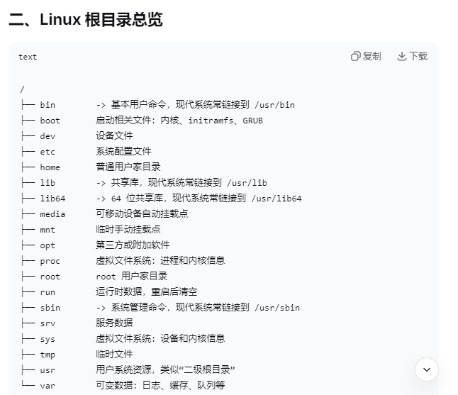

# Linux文件系统是树形结构,最顶层是根目录/
## 一切路径从/开始
## 目录本身也是文件
## 目录可以作为"挂载点“,把磁盘分区、u盘、网络存储挂载到某个目录

# / :根目录
# . :当前目录
# .. :上一级目录
# ~ :当前用户家目录
# - :上一次所在目录,如 cd -
# 绝对路径 :从/出发,如 /etc/passwd
# 相对路径 :不从/开始,如 etc/passwd

# 根目录总览

## /bin :基本用户命令
### 如 ls、cp、mv；现代发行版多链接到 /usr/bin

## /sbin :系统管理命令
### 如 fdisk、reboot；现代多链接到 /usr/bin

## /boot :启动文件
### 内核vmlinuz、initrd.img、GRUB配置

## /dev :设备文件
### 如 /dev/sda、/dev/tty、/dev/null

## /etc :系统配置文件
### 如 /etc/passwd、/etc/fstab、/etc/hosts

## /home :普通用户家目录
### 如 /home/user

## /root :root用户家目录
### 不是/homw/root

## /lib :共享库和内核模块
### 现代多链接到 /usr/lib

## /lib64 :64位共享库
### 现代多链接到 /usr/lib64

## /media L可移动媒体挂载
### u盘、光盘自动挂载常用

## /mnt :临时挂载点
### 管理员手动挂载常用

## /proc :虚拟文件系统
### 进程、内存、CPU信息，如 /proc/cpuinfo

## /srv :服务数据
### 如 网站、FTP数据

## /sys :虚拟文件系统
### 设备、驱动、内核对象信息

## /tmp :临时文件
### 所有用户可写,通常重启清空,权限常为1777

## /usr :用户系统资源(Unix System Resource),不是用户的意思
### 包含大量程序、库、文档
## /usr 常见子目录
### /usr/bin :普通用户命令
### /usr/sbin :系统管理命令
### /usr/lib :程序库
### /usr/lib64 :64位程序库
### /usr/local :本地编译安装软件,类似/usr
### /usr/local/bin :本地安装的可执行程序
### /usr/share :架构无关共享程序,如文档、手册
### /usr/include :C/C++头文件
### /usr/src :源码、如内核源码
### /usr/share/man :man手册
### /usr/share/doc :软件文档

## /var :可变数据,存放经常变化的数据
### 日志、缓存、邮件、队列、数据库等
## /var 常见子目录
### /var/log :日志文件
### /var/cache :程序缓存
### /var/spool :队列数据，如打印、邮件
### /var/mail :用户邮件
### /var/tmp :临时文件,但比/tmp保留更久
### /var/lib :程序状态数据,如数据库
### /var/run :运行时数据,通常链接到/run
### /var/lock :锁文件,通常链接到/run/lock

## /lost+found :文件系统恢复目录
### ext2/3/4分区可能有,fsck恢复文件存放处

