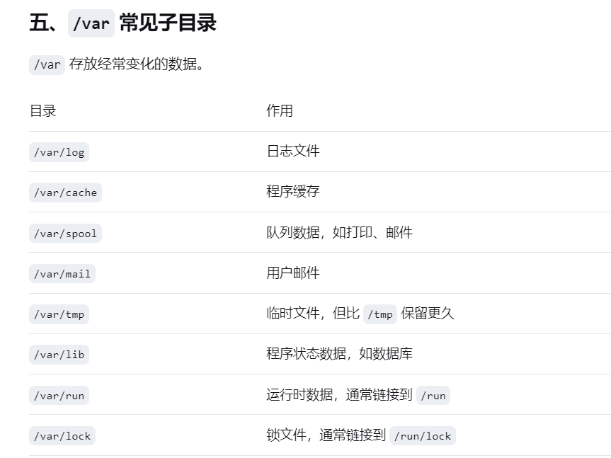
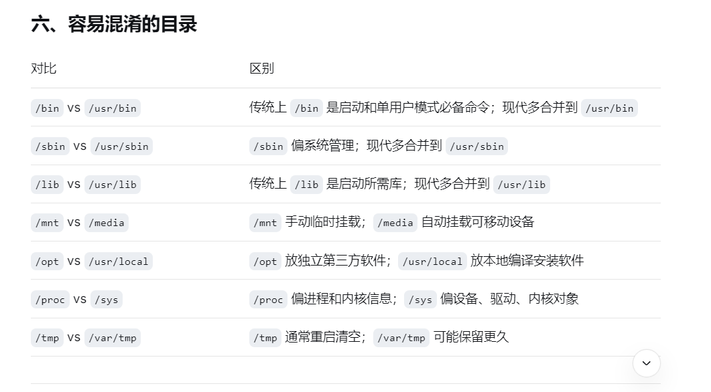
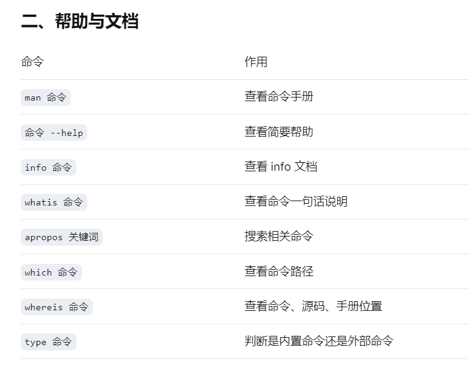
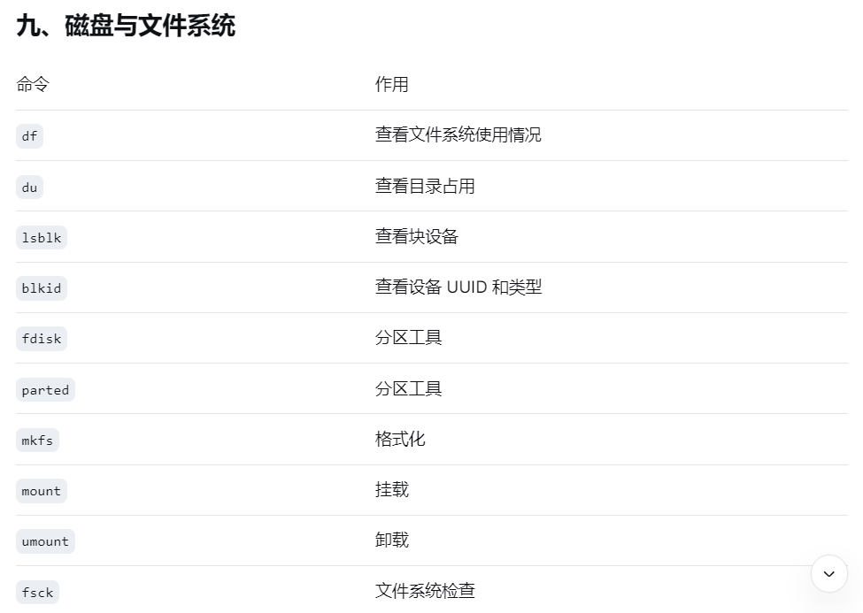
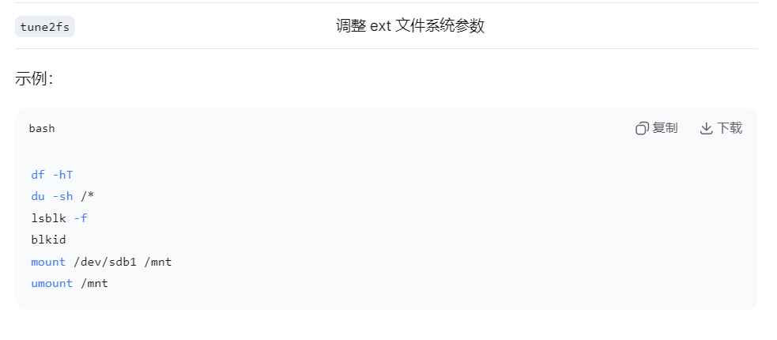

# Linux文件系统是树形结构,最顶层是根目录/
## 一切路径从/开始
## 目录本身也是文件
## 目录可以作为"挂载点“,把磁盘分区、u盘、网络存储挂载到某个目录

# / :根目录
# . :当前目录
# .. :上一级目录
# ~ :当前用户家目录
# - :上一次所在目录,如 cd -
# 绝对路径 :从/出发,如 /etc/passwd
# 相对路径 :不从/开始,如 etc/passwd

# 1、根目录总览

## /bin :基本用户命令
### 如 ls、cp、mv；现代发行版多链接到 /usr/bin

## /sbin :系统管理命令
### 如 fdisk、reboot；现代多链接到 /usr/bin

## /boot :启动文件
### 内核vmlinuz、initrd.img、GRUB配置

## /dev :设备文件
### 如 /dev/sda、/dev/tty、/dev/null

## /etc :系统配置文件
### 如 /etc/passwd、/etc/fstab、/etc/hosts

## /home :普通用户家目录
### 如 /home/user

## /root :root用户家目录
### 不是/homw/root

## /lib :共享库和内核模块
### 现代多链接到 /usr/lib

## /lib64 :64位共享库
### 现代多链接到 /usr/lib64

## /media L可移动媒体挂载
### u盘、光盘自动挂载常用

## /mnt :临时挂载点
### 管理员手动挂载常用

## /proc :虚拟文件系统
### 进程、内存、CPU信息，如 /proc/cpuinfo

## /srv :服务数据
### 如 网站、FTP数据

## /sys :虚拟文件系统
### 设备、驱动、内核对象信息

## /tmp :临时文件
### 所有用户可写,通常重启清空,权限常为1777

## /usr :用户系统资源(Unix System Resource),不是用户的意思
### 包含大量程序、库、文档
## /usr 常见子目录
### /usr/bin :普通用户命令
### /usr/sbin :系统管理命令
### /usr/lib :程序库
### /usr/lib64 :64位程序库
### /usr/local :本地编译安装软件,类似/usr
### /usr/local/bin :本地安装的可执行程序
### /usr/share :架构无关共享程序,如文档、手册
### /usr/include :C/C++头文件
### /usr/src :源码、如内核源码
### /usr/share/man :man手册
### /usr/share/doc :软件文档

## /var :可变数据,存放经常变化的数据
### 日志、缓存、邮件、队列、数据库等
## /var 常见子目录
### /var/log :日志文件
### /var/cache :程序缓存
### /var/spool :队列数据，如打印、邮件
### /var/mail :用户邮件
### /var/tmp :临时文件,但比/tmp保留更久
### /var/lib :程序状态数据,如数据库
### /var/run :运行时数据,通常链接到/run
### /var/lock :锁文件,通常链接到/run/lock

## /lost+found :文件系统恢复目录
### ext2/3/4分区可能有,fsck恢复文件存放处

# 2、帮助与文档
## man 命令:查看命令手册
### man ls
## 命令 help:查看简要帮助
### ls --help
## info 命令:查看info文档
## whatis 命令:查看命令一句话说明
## apropos 关键词:搜索相关命令
## which 命令:查看命令路径
## which python3
## whereis 命令:查看命令、源码、手册位置
## type 命令:判断是内置命令还是外部命令
### type cd

# 3、文件与目录操作
## pwd :显示当前目录
## ls :列出目录内容
### ls -lh
### ls -la
## cd :切换目录
### cd ..
### cd ~
## mkdir :创建目录
### mkdir -p /tmp/a/b/c
## rmdir :删除空目录
## touch :创建空文件或更新时间
## cp :复制
### cp -r dir1 dir2
## mv :移动或重命名
### mv old.txt new.txt
## rm :删除
### rm -rf /tmp/test
## ln :创建链接
### ln -s /usr/bin/python3 /usr/local/bin/python
## tree :树形显示目录
## stat :查看文件详细信息
## file :查看文件类型
## basename :取文件名
## dirname :取目录名

# 4、查看与编辑文本
## cat :查看全部内容
### cat /etc/passwd
## tac :倒序查看
## less :分页查看,推荐
### less /var/log/messages
## more :分页查看,较老
## head :查看开头
### head -n 20 file.txt
## tail :查看结尾
### tail -n 50 file.txt
### tail -f /var/log/syslog (tail -f 常用于实时看日志)
## nl :显示行号
## wc :统计行数、单词数、字节数
### wc -l file.txt
## sort :排序
### sort file.txt | uniq -c
## uniq :去重
## cut :截取列
## tr :替换或删除字符
## grep :搜索文本
### grep "error" /var/log/syslog
### grep -rn "root /etc
## sed :流编辑器
## awk :文本处理语言
## vim :强大编辑器
## nano :简单编辑器

# 5、查找与定位
## find :按条件查找文件
### -name :按文件名
### -type f :普通文件
### -type d :目录
### -size +100M :大于100M
### -mtime -7 :7天内被修改过
### -user :按用户
### -perm :按权限
## locate :基于数据库快速查找
### locate nginx.conf
## updatedb :更新locate数据库
## which :查找命令路径
## whereis :查找命令相关文件
## grep -r :递归搜索内容
### grep -rn "Listen" /etc/httpd

# 6、权限与用户管理
## chmod :修改权限
### chmod 755 script.sh
### chomd +x script.sh
## chown :修改所有者
### chown user:user file.txt
## chgrp :修改所属组
## umask :默认权限掩码
## id :查看用户和组
### id tom
## whoami :当前用户
## su :切换用户
## sudo :已其他用户执行，通常是root
## passwd :修改密码
### sudo passwd tom
## useradd :添加用户
### sudo useradd -m tom
## usermod :修改用户
## userdel :删除用户
## groupadd :添加组

# 7、进程与作业管理
## ps :查看进程快照
### ps aux
### ps -ef
## top :动态查看进程
### top
## htop :更友好的top
## pgrep :按名称查进程
### pgrep nginx
## pkill :按名称杀进程
### pkill nginx
## kill :按PID杀进程
### kill -9 1234
## killall :按名称杀进程
## jobs :查看后台作业
### jobs
## bg :后台运行
## fg :前台运行
### fg &1
## nohup :忽略挂断,后台运行
### nohup python app.py & 
## & :命令后台运行
## nice :调整启动优先级
## renice :调整运行中优先级
## lsof :查看打开的文件和端口
### lsof -i :80
## strace :跟踪系统调用

# 8、系统信息与资源查看

## uname -a :内核和系统信息
## hostname :主机名
## uptime :开机时间和负载
## date :日期时间
## cal :日历
## who :当前登录用户
## w :当前登录用户及活动
## free -h :内存使用
## df -h :磁盘空间
## du -sh :目录占用
### du -sh /var/log
## lscpu :CPU信息
## lsblk :块设备信息
## lspci :PCI设备
## lsusb :USB设备
## dmesg :内核日志
### dmesg | tail
## journalctl :systemd日志
### journalctl -xe
## vmstat :虚拟内存统计
## iostat :IO统计
## sar ::系统活动报告

