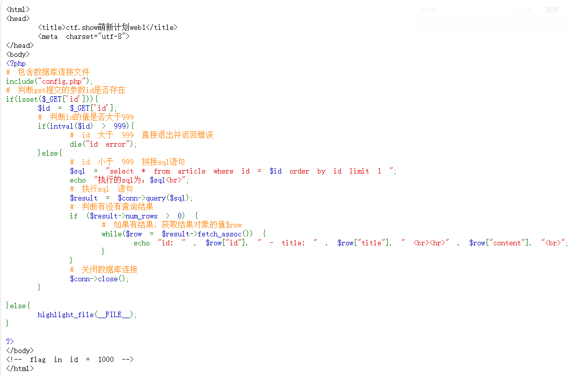

# 打开靶场后发现是代码审计

# 考点:SQL注入绕过数字限制

# 代码审计
## 1、intval($id):将$id转换为整数
## intval():从字符串开头解析数字,遇到非数字字符(如字母)就会停止
### 如intval("1000abc")结果是1000
### intval("1e3")结果是1

## 2、` $sql = "select * from article where id = $id order by id limit 1 ";`:从article表中查询id等于变量$id的记录,按id排序,只取1条(注意这里的$id没有用引号包裹,存在SQL注入风险)

## 3、`$result = $conn->query($sql);`:执行上面拼接好的SQL语句

## 4、`$result->num_rows > 0`:判断查询结果是否大于0行

## 5、`while($row = $result->fetch_assoc())`:循环遍历查询结果，fetch_assoc() 返回关联数组

# 思路
## 1、闭合绕过:代码审计后id>999报错,id<999继续运行,且flag是id=1000,在url的show后面接/?id=1 or id=1000 --+ ,--+注释掉$id后面的order by id limit 1即可得到flag:ctfshow{eb73212a-2188-42c1-8c62-92c7985aeedd}

## 2、绕过intval():发现是用intval($id)进行比较,intval()只截取开头数字,输入?id=999+1返回"99 1","+"被编码为空格了,输入?id=999%2B1即可得到flag

## 3、输入?id=0x3e8(十六进制的1000)绕过intval()