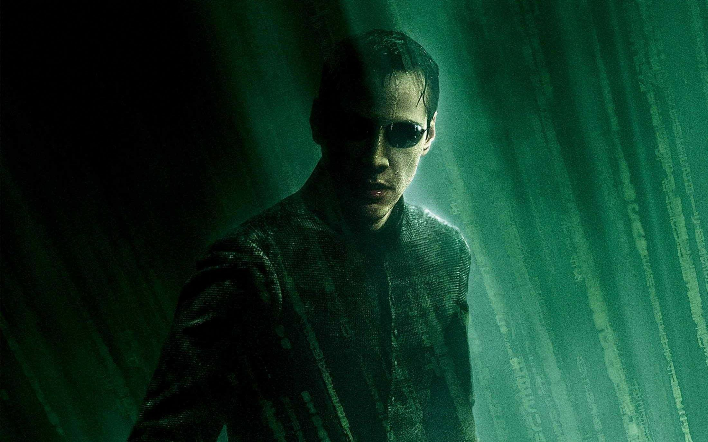
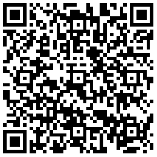
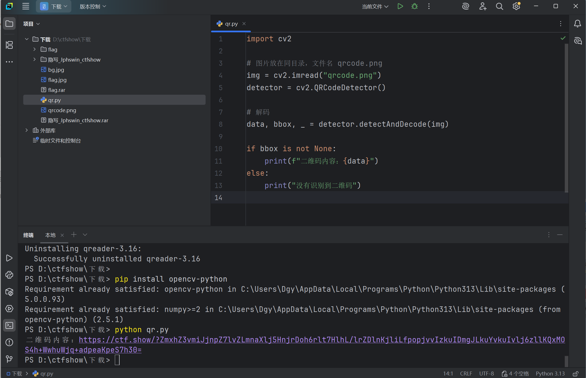

# 工具地址：https://www.lanzoui.com/i9hm2di

# 考点:JPEG 图像隐写

# 先下载工具JPHS,打开jpg图片,点击选项里的seek(提取),直接点击ok保存,再将它拖到010,可以看到为png文件,重命名之后打开得到一个二维码,可将其放入在线网址(https://uutool.cn/qrcode-decode/)解析,也可以用qr脚本,得到一段url(https://ctf.show/?ZmxhZ3vmiJjnpZ7lvZLmnaXlj5HnjrDoh6rlt7HlhL/lrZDlnKjliLfpopjvvIzkuIDmgJLkuYvkuIvlj6zllKQxMOS4h+WwhuWjq+adpeaKpeS7h30=),可以看出是base64解码,解密之后即可得到flag:flag{战神归来发现自己儿子在刷题，一怒之下召唤10万将士来报仇}

