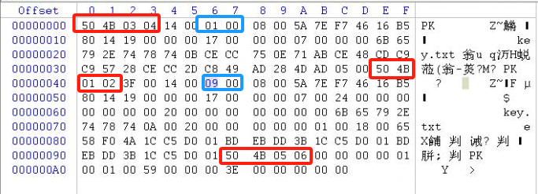

[text](zip/杂项6.zip)

# 题目:小明的压缩包又忘记密码了？他去电脑维修店去修，人家扔出来说这个根本就没有密码，是个假密码。小明懵了，明明有密码的啊，你能帮帮小明吗？

# 知识点:https://www.cnblogs.com/huangshisan/p/17721133.html

# 1、方法一:将压缩包后缀改为7z打开后得到flag
# 2、方法二:快速定位到目录区头文件标记处开，50 4B 03 04，这是压缩源文件数据区头文件标记，50 4B 01 02，这是压缩源文件目录区头文件标记,猜测是伪加密.使用010后发现50 4B 01 02 后是09 00，将其改为00 00,再解压可得到flag.txt查看得到flag为：flag{c_t_f_s_h_o_w}

# zip文件由三部分组成:压缩源文件数据区、压缩文件目录区、压缩原文件目录结束标志


## 1、压缩源文件数据区:
### 50 4B 03 04:头文件标记(本地文件头),每个压缩文件开始的地方(PK)
### 14 00:解压文件所需pkware版本
### 00 00:`全局方式位标记`(有无加密),头文件标记后2bytes
## 2、压缩源文件目录区:
### 50 4B 01 02:目录中文件文件头标记(中央目录文件头),记录所有压缩文件的属性、偏移量
### 3F 00:压缩使用的pkware版本
### 14 00:解压文件所需pkware版本
### 00 00:`全局方式位标记`(有无加密,伪加密的关键),目录文件标记后4bytes
## 3、压缩源文件目录结束标志:
### 50 4B 05 06:目录结束标记(中央目录结束记录),zip文件的结尾
## 4、全局方式位标记:全局方式位标记的4个数字中只有第二个数字对其有影响,其他的值不影响加密属性
### 第二个数字为奇数时->加密
### 第二个数字为偶数时->伪加密
## 5、判断zip是真加密还是伪加密:
```
(1)无加密
压缩源文件数据区的全局加密为00 00
且压缩源文件目录区的全局方式位标记为00 00
```
```
(2)伪加密
压缩源文件数据区的全局加密为00 00
且压缩源文件目录区的全局方式位标记为09 00
```
```
(3)真加密
压缩源文件数据区的全局加密为09 00
且压缩源文件目录区的全局方式位标记为09 00
```