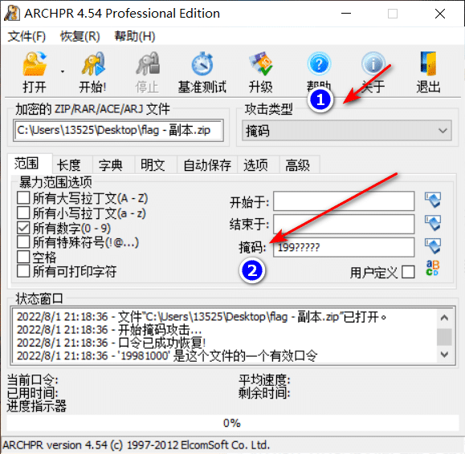

题目:
`文件的主人喜欢用生日做密码，而且还是个90后`

# 查看WP 根据提示生日做密码(可得知是一个八位的纯数字密码),而且是90后(限定了密码范围：19900000-19999999)密码应该是199xxxxx 然后用ARCHPR这个软件爆破得到密码 选择掩码模式，然后用 ? 代替X 来爆破压缩包密码 密码是 19981000 

！

ARCHPR破解工具：http://www.downza.cn/soft/208982.html