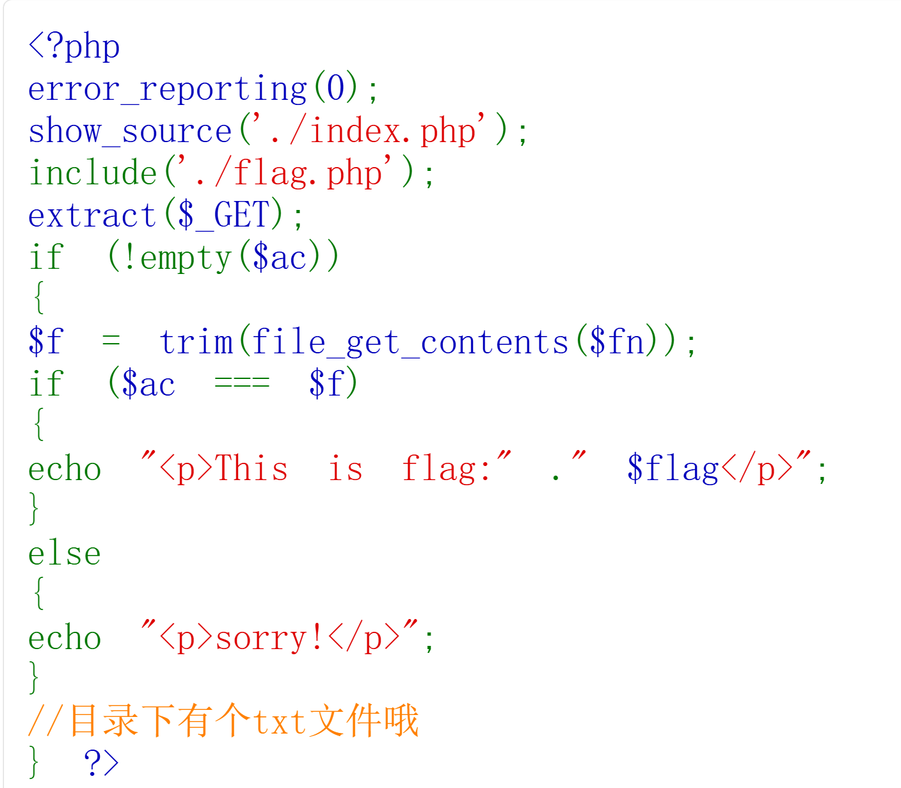

# 1、`trim()`:去掉字符串开头和结尾的空白字符(如空格、换行符\n、制表符\t)

## 例:"hello\n" -> "hello"
## " hello " -> "hello"

# 2、`file_get_content()`:文件读取函数

## 作用:把整个文件内容读进一个字符串

## `data://` :可以让你:凭空创造文件",自己决定文件内容从而控制后面的比较逻辑

## `data://` 协议标准格式:`data://[<mediatype>][;base64],<data>`

### 常用、通用:`data://text/plain(text/html、image/png)`

## 常见的可读协议:
### `file://` (默认):读取本地协议
### `http://`、`https://` :读取远程网页内容
### `ftp://` :读取FTP文件
### `data://` :直接读取文本
### `php://filter`、`php://input` :读取PHP输入流(进阶绕过)