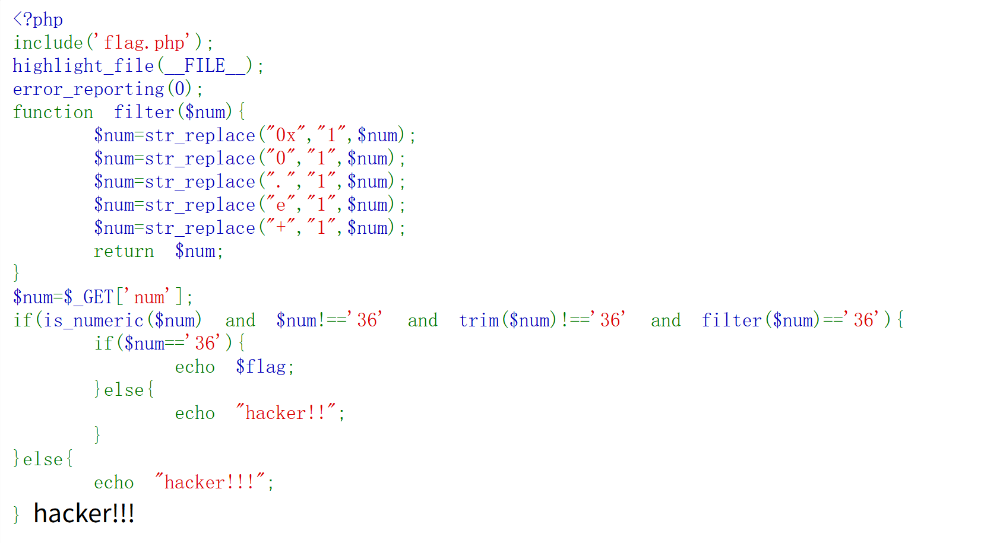

# 1、isset():用来判断变量是否已定义并且值不为NULL

## (1)变量存在且值不是NULL -> true
## (2)变量未定义或值为NULL -> false
## (3)未定义:false
## (4)NULL:false
## (5)" ":true
## (6)0:true
## (7)"0":true
## (8)false:true

# 2、||:逻辑或
## A||B
### (1)只要A或B有一个为True,则true
### (2)只有A和B都为false，才为false
## 短路求值:
### (3)若左边A为true,则右边B不执行
### (4)若右边A为false,才会执行右边B
## 补充:
### |:按位或
#### A|B:两边都执行,返回整数

# 3、json_decode():将JSON格式字符串解码为PHP变量
## 两种情况下返回NULL:
### (1)JSON字符串本身是null
#### json_decode("null"); //返回PHP的NULL
### (2)JSON字符串格式无效,解码失败
#### json_decode("abc");
#### json_decode("{");
#### json_decode("NULL"); //返回NULL,因为JSON的null必须小写

# 4、`if($y=$b===NULL)`:赋值运算符=、全等比较运算符===、运算符优先级
## `$y=$b===NULL;` -> `$y=($b===NULL);`
### PHP中,===优先级高于=:先算`$b===NULL`得到一个布尔值再赋值给$y
## ===:严格比较运算符,同时比较值和类型,两者相同返回true

