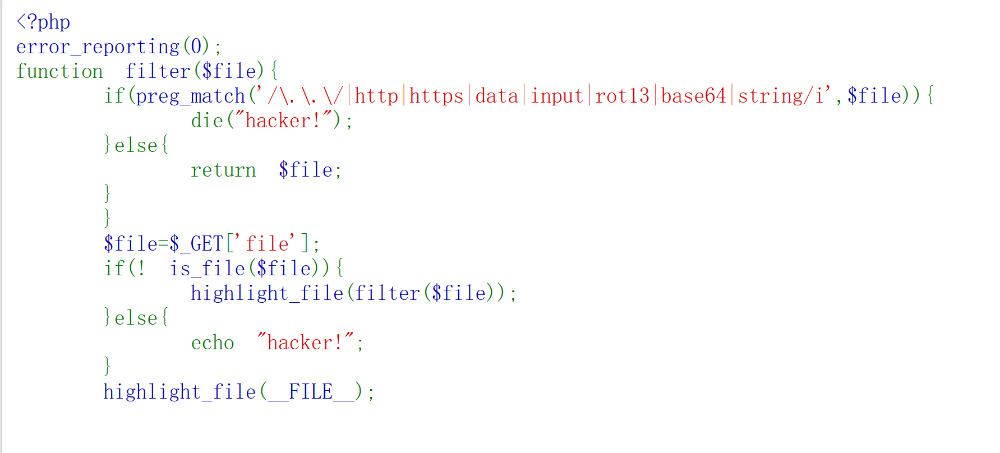

# 考点:任意文件读取漏洞

# 1、filter():过滤函数
## 常见过滤器:rot13、base64、string

# 2、伪协议(data://、input://、php://):不是真正的协议,只是长得像协议
## php://filter ：对数据流进行过滤(编码、解码)
## http、https:远程协议,不是伪协议
## 作用:
### (1)绕过文件后缀限制:php:filter
### (2)绕过is_file()检查
### (3)凭空造数据:data://(自定义内容,用于比较或执行)
### (4)读取压缩包内文件:phar://、zip：//
### (5)执行任意代码:php:input和include配合

# 3、is_file():判断是否为一个真实存在的本地文件;对于php://filter这类伪协议返回false

# 4、highlight_file():支持伪协议,能够读取伪协议内容并高亮输出,相当于读取任意文件
