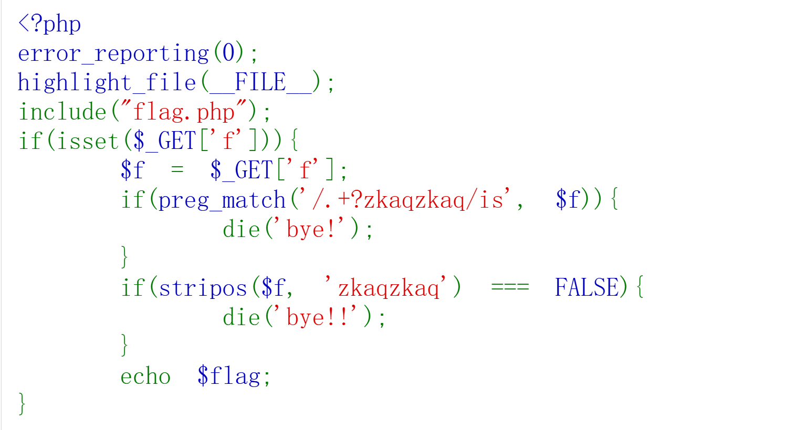

# 1、stripos():要求字符串中必须包含()内的,不区分大小写,否则会被拦截

## 例:stripos($f,'zkaqzkaq')===FALSE 

## 意思是stripos()在$f中查找子串'zkaqzkaq'(不区分大小写),返回首次出现的位置(从0开始).如果找不到则返回FALSE

## 全等比较:===

# 2、preg_match():PHP中用于执行正则表达式匹配的核心函数

## 例:preg_match(正则规则,目标字符串) 检查内容:$f里面是否存在"前面至少有一个字符,后面紧跟着zkaqzkaq"的情况

# 3、/.+?zkaqzkaq/is :整体含义：匹配 zkaqzkaq（不区分大小写），且它前面至少有一个字符作为前缀。如果匹配成功（即存在前缀），则执行下一行 die('bye!');。

## /:正则表达式的开始定界符
## .:匹配任意一个字符(默认不匹配换行,但s修饰符让它匹配换行)
## +?:前面的.出现一次或多次(尽可能少地匹配)
## /:结束定界符
## i:修饰符,使匹配不分大小写
## s:修饰符,让.能匹配换行符