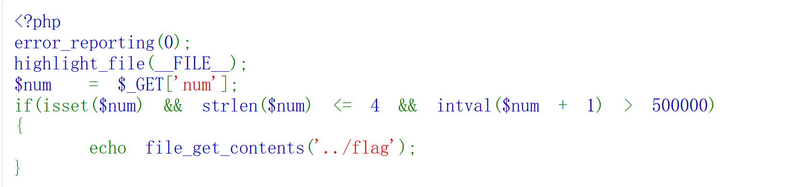

!

# 1、intval:将字符串转换成整数,从左到右解析数字,遇到非数字字符停止

# 2、科学计数法:1e9 是PHP中一个科学计数法表示的字符串.在数学中,e表示“乘以10的几次方”,所以1e9就是1x10的9次方

## 例:1e3=1x10的三次方=1000

## 2e6=1x10的6次方

# 3、PHP中的+号是数学运算符,当+号连接一个字符串和一个数字时,PHP会自动把字符串转换成数字,再做加法

## 例:"123abc"+1=123+1=124 //只认开头的数字

## "2e3"+5=2000+5 //识别科学计数法

## "hello"+1=0+1=1 //开头不是数字,转为0

## 绕过方法：科学计数法

