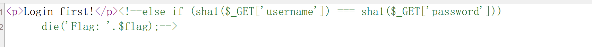

# 1、sha1():类型松散判断函数,试试传数组

## sha1()存在一个漏洞:如果传入的参数不是字符串(如数组),sha1()会返回Null,而不是报错终止

## 两种常见题型
### (1)数组绕过(利用===或==)
#### ===:严格比较
#### sha1($a)===sha1($b)时,传入?username[]=1&password[]=2

### (2)弱类型碰撞(==)
#### ==:松散比较
#### 有些字符串的哈希值会以0e开头(科学计数法),在PHP松散比较中,0e12345会被当作浮点数0处理("哈希碰撞")
