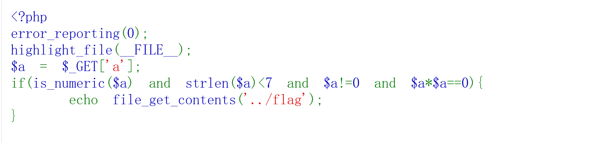

# 1、is_nmeric($a):$a必须是数字或数字格式的字符串(如:"123"、"1.23"、"1e3"),允许前导空格

# 2、$a!=0:$a的值不能等于0(松散比较,==的反面)

# 3、$a*$a==0:$a乘自身必须等于0(松散比较)

# 绕过方法:利用浮点数下溢

##  思路:传入一个极小的正浮点数,使得:
### 1、$a不等于0(数值极小但非0)
### 2、$a*$a因为数值太小而下溢为0(==成立)

## 例:1e-200=1x10的-200次方(-200也可以变为-300、-400)
## 1e-200*1e-200=1e-400