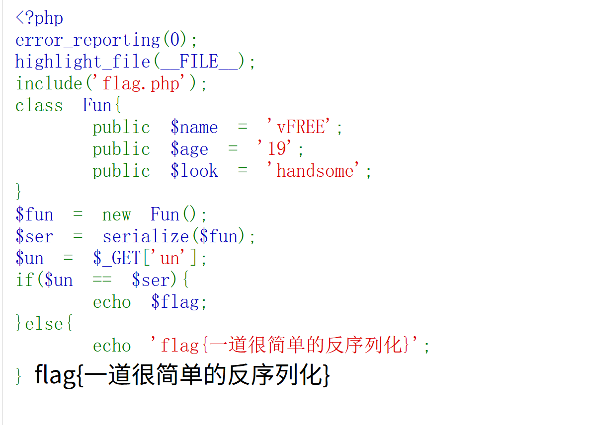

# 1、serialize($fun):将$fun对象序列化为字符串

## 例:$ser=serialize($fun):将$fun对象序列化为字符串,存入$ser

## 通过serialize($fun)得到的字符串是:O:3:"Fun":3:{s:4:"name";"vFREE";s:3:"age";s:2:"19";s:4:"look";s:8:"handsome";}

### O:3:"Fun" ->对象,类名长度3,类名Fun
### 3 ->有2个属性
### s:4:"name" ->属性名name,长度4
### s:5:"vFREE" ->属性值vFREE,长度5
### 其余类似